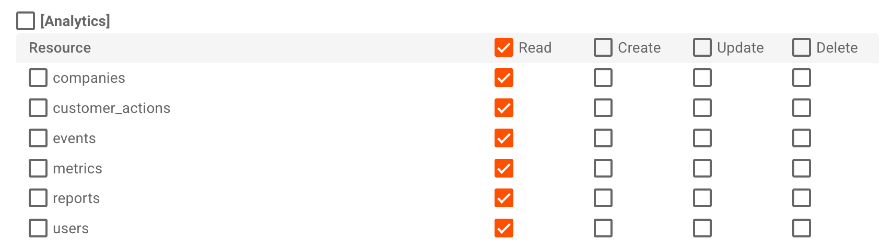

# Prometheus Metrics Exporter for Moesif

A Prometheus exporter that pulls API analytics data from [Moesif](https://www.moesif.com) via its Management API and exposes them as Prometheus metrics.

If you already use Moesif to capture API traffic, this exporter lets you bring that data into Prometheus and Grafana without any additional instrumentation.

## How It Works

```
Prometheus  --scrape-->  This Exporter  --query-->  Moesif Management API
  (pull)                  /metrics        (REST)     (your existing data)
```

Each time Prometheus scrapes the `/metrics` endpoint, the exporter queries Moesif for data within a rolling time window (default: last 60 seconds) and returns the results in Prometheus exposition format.

## Prerequisites

- Node.js >= 18.0.0
- A Moesif account with API traffic data
- A Moesif Management API Key

### Getting Your Moesif Management API Key

1. Log in to your [Moesif Dashboard](https://www.moesif.com/wrap)
2. Go to **Settings** (bottom-left gear icon)
3. Select **Management API Keys**
4. Create a new key with the following **Analytics Read** permissions:



The key needs **Read** access on these Analytics resources:
- companies
- customer_actions
- events
- metrics
- reports
- users

5. Copy your key

## Quick Start

```bash
# Clone the repo
git clone <repo-url>
cd prometheus-metrics-moesif

# Install dependencies
npm install

# Configure
cp .env.example .env
# Edit .env and add your Moesif Management API Key

# Start the exporter
npm start
```

The exporter starts on port `9277` by default. Verify it's running:

```bash
curl http://localhost:9277/metrics
```

## Configuration

All configuration is done via environment variables or a `.env` file.

| Variable | Required | Default | Description |
|----------|----------|---------|-------------|
| `MOESIF_MANAGEMENT_API_KEY` | Yes | — | Your Moesif Management API key |
| `MOESIF_API_BASE_URL` | No | `https://api.moesif.com` | Moesif API base URL |
| `PORT` | No | `9277` | Port the exporter listens on |
| `MOESIF_QUERY_WINDOW_SECONDS` | No | `60` | How far back (in seconds) to query Moesif on each scrape |
| `MOESIF_QUERY_DELAY_SECONDS` | No | `0` | Shift the query window back by this many seconds (see [Data Consistency](#data-consistency-and-delay)) |

## Prometheus Configuration

Add a scrape job to your `prometheus.yml`:

```yaml
scrape_configs:
  - job_name: 'moesif'
    scrape_interval: 60s
    static_configs:
      - targets: ['localhost:9277']
```

**Important:** The `scrape_interval` should match `MOESIF_QUERY_WINDOW_SECONDS` so that each scrape covers exactly the time period since the last scrape, with no gaps or overlaps.

For performance reasons, we do not recommend smaller number than 60s.

## Metrics Reference

All metrics are exposed as Prometheus **gauges** (except `moesif_scrape_errors_total` which is a counter). They represent values within the configured query window.

### Global Metrics

| Metric | Type | Description |
|--------|------|-------------|
| `moesif_api_calls_total` | Gauge | Total API calls in the query window |
| `moesif_api_calls_by_status` | Gauge | API calls by HTTP status code |
| `moesif_api_latency_p50_ms` | Gauge | 50th percentile latency (ms) |
| `moesif_api_latency_p90_ms` | Gauge | 90th percentile latency (ms) |
| `moesif_api_latency_p99_ms` | Gauge | 99th percentile latency (ms) |
| `moesif_active_users` | Gauge | Unique users in the query window |
| `moesif_active_companies` | Gauge | Unique companies in the query window |

### Per-Route Metrics

| Metric | Labels | Type | Description |
|--------|--------|------|-------------|
| `moesif_api_calls_by_route` | `route`, `status_code` | Gauge | API calls by route and status code |
| `moesif_api_latency_by_route_ms` | `route`, `percentile` | Gauge | Latency percentiles (p50/p90/p99) by route |

### Operational Metrics

| Metric | Type | Description |
|--------|------|-------------|
| `moesif_scrape_errors_total` | Counter | Number of failed Moesif API queries |
| `moesif_scrape_duration_ms` | Gauge | Time taken to query Moesif (ms) |

## Data Consistency and Delay

Moesif uses a distributed architecture with eventual consistency. This means the most recent few seconds of data may not be fully available when queried. Events go through ingestion, processing, and indexing, so there is a small delay before they appear in query results.

By default, the exporter queries from `[now - window, now]`. If you find that recent data is incomplete or inconsistent, you can shift the entire query window back by setting `MOESIF_QUERY_DELAY_SECONDS`:

```
Without delay (default):   |-------- 60s --------|
                                                  now

With 10s delay:            |-------- 60s --------|
                                            now-10s    now
                                              ^         ^
                                          query end   (skipped)
```

For example, with `MOESIF_QUERY_DELAY_SECONDS=10` and `MOESIF_QUERY_WINDOW_SECONDS=60`, each scrape queries the window `[now-70s, now-10s]`, giving Moesif an extra 10 seconds for data to arrive and be indexed.

A delay of **10-30 seconds** is recommended for most deployments. The tradeoff is slightly less real-time data in exchange for more accurate and complete metrics.

## Why Gauges Instead of Counters?

Prometheus counters are monotonically increasing and work with `rate()`. However, this exporter queries Moesif for a rolling time window on each scrape rather than maintaining cumulative state. The returned values can go up or down between scrapes (e.g., a busy minute vs. a quiet minute), so gauges are the correct type.

In Grafana, use the gauge values directly instead of wrapping them in `rate()`.

## Example Grafana Queries

```promql
# Total API calls per scrape window
moesif_api_calls_total

# 5xx errors by status code
moesif_api_calls_by_status{status_code=~"5.."}

# p90 latency
moesif_api_latency_p90_ms

# Top routes by traffic
topk(10, moesif_api_calls_by_route)

# p99 latency for a specific route
moesif_api_latency_by_route_ms{route="/api/v1/users", percentile="p99"}

# Active users over time
moesif_active_users
```

## Endpoints

| Path | Description |
|------|-------------|
| `/metrics` | Prometheus metrics endpoint |
| `/health` | Health check (returns `{"status": "ok"}`) |

## Development

```bash
# Run with auto-reload on file changes (Node.js 18+)
npm run dev
```
